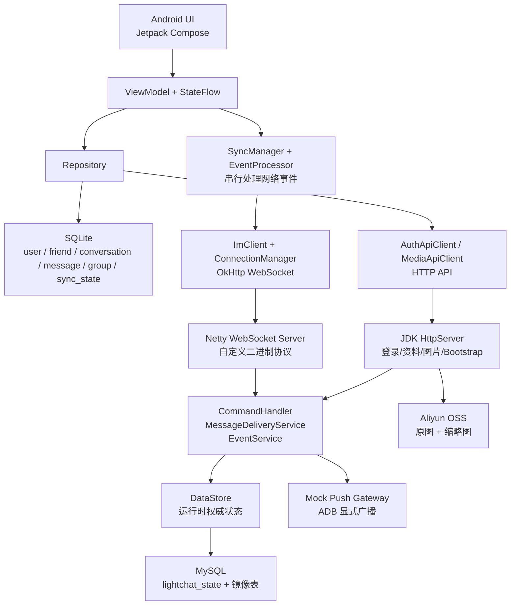
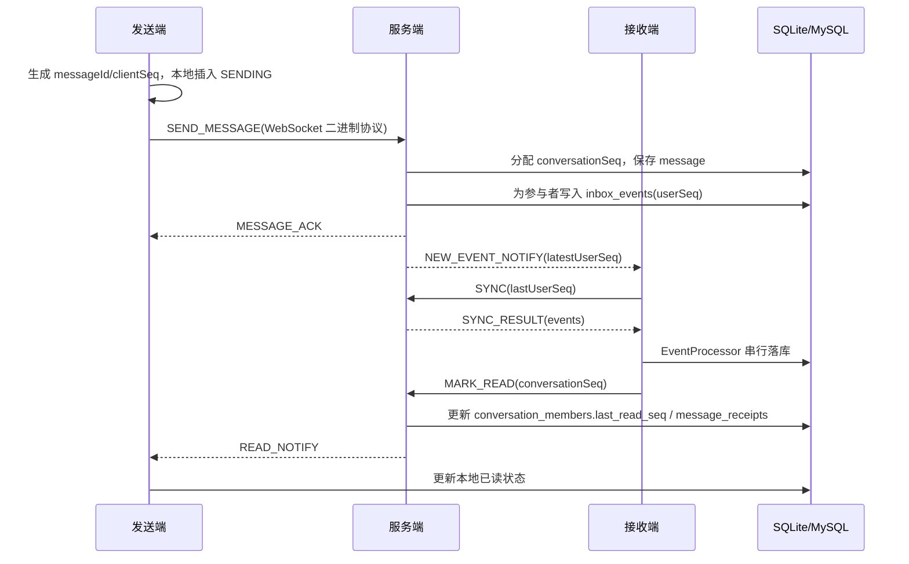

# LightChat

LightChat 是一个面向 IM 核心链路实践的 Android 即时通讯项目。项目包含 Android 客户端、Kotlin/JVM 服务端、本地 SQLite 缓存、MySQL 持久化、阿里云 OSS 图片存储、WebSocket 自定义二进制协议、消息同步、已读回执、群聊、转发、图片预览和本地 Mock 离线推送等能力。

## 仓库说明

本仓库包含 LightChat 的 Android 客户端源码、Kotlin/JVM 服务端源码、Gradle 构建配置、GitHub Actions CI 配置、单元测试代码、架构说明、数据库表设计、测试记录、性能优化记录、AI 使用记录和关键决策文档。客户端代码位于 `app/`，服务端代码位于 `server/`，两端共用同一套 IM 业务模型和自定义 WebSocket 二进制协议。

仓库只提交可以复现项目构建、测试和答辩说明所需的内容；本机启动脚本、数据库数据目录、运行日志、抓包截图、录屏文件、AccessKey、个人环境变量和临时压测数据不进入 Git 管理，避免泄露敏感信息，也避免把本地调试状态混入源码。

## 目录结构

```text
LightChat/  # 项目根目录
|-- .github  # GitHub 配置目录
|   `-- workflows  # GitHub Actions 工作流目录
|       `-- ci.yml  # GitHub Actions CI，自动运行测试和构建
|-- .gitignore  # Git 忽略规则，排除密钥、日志、构建产物和本地数据
|-- AI_USAGE.md  # AI 辅助方案采纳与未采纳记录
|-- app  # Android 客户端模块
|   |-- build.gradle.kts  # Android 客户端模块构建配置
|   |-- proguard-rules.pro  # Android 混淆与压缩规则
|   `-- src  # Android 源码目录
|       |-- main  # Android 主源码集
|       |   |-- AndroidManifest.xml  # Android 应用清单，声明权限、组件和入口 Activity
|       |   |-- java  # Kotlin/Java 源码根目录
|       |   |   `-- com  # Java 包路径
|       |   |       `-- lightchat  # 客户端主包
|       |   |           |-- data  # 客户端数据层
|       |   |           |   |-- local  # 本地 SQLite、Token 和会话数据
|       |   |           |   |   |-- dao  # SQLite DAO 目录
|       |   |           |   |   |   |-- ConversationDao.kt  # 会话表 DAO，负责会话列表、置顶、免打扰和未读状态
|       |   |           |   |   |   |-- FriendRequestDao.kt  # 好友申请 DAO，负责申请缓存和状态更新
|       |   |           |   |   |   |-- GroupDao.kt  # 群资料、群成员和群会话状态 DAO
|       |   |           |   |   |   |-- MessageDao.kt  # 消息 DAO，负责消息分页、搜索、状态和回执数据
|       |   |           |   |   |   |-- SyncStateDao.kt  # 同步游标 DAO，保存 lastUserSeq 等增量同步进度
|       |   |           |   |   |   `-- UserDao.kt  # 用户和好友资料 DAO，负责资料、头像和联系人缓存
|       |   |           |   |   |-- DatabaseHelper.kt  # SQLiteOpenHelper，定义本地表结构、索引和迁移
|       |   |           |   |   |-- DatabaseSeeder.kt  # 本地测试/默认数据初始化辅助
|       |   |           |   |   |-- TokenManager.kt  # JWT Token 本地保存、读取和会话持久化
|       |   |           |   |   `-- UserSession.kt  # 当前登录用户会话信息管理
|       |   |           |   |-- remote  # HTTP 远程接口目录
|       |   |           |   |   `-- AuthApiClient.kt  # HTTP API 客户端，处理登录注册、资料、媒体和 Bootstrap 请求
|       |   |           |   `-- repository  # Repository 数据仓库目录
|       |   |           |       |-- AuthRepository.kt  # 认证仓库，封装登录注册和 Token 保存流程
|       |   |           |       |-- ConversationRepository.kt  # 会话仓库，连接会话 DAO 与界面层
|       |   |           |       |-- MessageRepository.kt  # 消息仓库，封装消息读写、分页和状态更新
|       |   |           |       `-- UserRepository.kt  # 用户仓库，封装资料、好友和头像相关数据访问
|       |   |           |-- event  # 应用内事件目录
|       |   |           |   `-- AppEvents.kt  # 应用内事件总线，通知 UI 刷新和跨页面状态变化
|       |   |           |-- im  # IM 长连接目录
|       |   |           |   |-- ConnectionManager.kt  # WebSocket 连接管理，负责连接、鉴权、收包和发包
|       |   |           |   |-- ConnectionState.kt  # IM 长连接状态定义
|       |   |           |   |-- HeartbeatManager.kt  # 心跳发送与心跳 ACK 超时检测
|       |   |           |   |-- ImClient.kt  # IM 客户端门面，封装协议命令发送能力
|       |   |           |   |-- ImForegroundService.kt  # 前台保活服务，用于维持 IM 连接生命周期
|       |   |           |   `-- ReconnectManager.kt  # 断线重连与指数退避策略管理
|       |   |           |-- LightChatApplication.kt  # Application 初始化数据库、会话、网络和全局服务
|       |   |           |-- MainActivity.kt  # Android 主 Activity，承载 Compose 根界面
|       |   |           |-- MainContent.kt  # 客户端主内容入口，组装主导航和全局状态
|       |   |           |-- model  # 客户端领域模型目录
|       |   |           |   |-- Conversation.kt  # 客户端会话领域模型
|       |   |           |   |-- ConversationId.kt  # 单聊/群聊会话 ID 生成规则
|       |   |           |   |-- FriendRequest.kt  # 好友申请领域模型
|       |   |           |   |-- GroupMember.kt  # 群成员领域模型
|       |   |           |   |-- ImGroup.kt  # 群聊领域模型
|       |   |           |   |-- Message.kt  # 消息领域模型和消息类型/状态定义
|       |   |           |   `-- User.kt  # 用户资料领域模型
|       |   |           |-- notification  # 通知与 Mock 推送目录
|       |   |           |   |-- MockVendorPushReceiver.kt  # 本地 Mock 推送广播接收器
|       |   |           |   `-- NotificationHelper.kt  # 系统通知创建与展示工具
|       |   |           |-- protocol  # 客户端自定义协议目录
|       |   |           |   |-- Cmd.kt  # 客户端自定义协议命令号定义
|       |   |           |   |-- Packet.kt  # 客户端协议包数据结构
|       |   |           |   `-- ProtocolCodec.kt  # 客户端二进制协议编码与解码
|       |   |           |-- sync  # 增量同步目录
|       |   |           |   |-- EventProcessor.kt  # 增量事件串行落库处理器
|       |   |           |   |-- EventType.kt  # 同步事件类型定义
|       |   |           |   |-- SyncEvent.kt  # 同步事件数据结构
|       |   |           |   `-- SyncManager.kt  # 增量同步调度，负责 SYNC 拉取和游标推进
|       |   |           |-- ui  # Compose UI 页面目录
|       |   |           |   |-- chat  # 聊天详情与图片相关 UI
|       |   |           |   |   |-- ChatInputBar.kt  # 聊天输入栏，处理文本、图片、@ 和发送动作
|       |   |           |   |   |-- ChatMentionDialog.kt  # @ 成员选择弹窗
|       |   |           |   |   |-- ChatMessageBubble.kt  # 消息气泡 UI，支持文本、图片、名片和合并转发
|       |   |           |   |   |-- ChatMessageList.kt  # 聊天消息列表，负责分页、定位和高亮展示
|       |   |           |   |   |-- ChatMessageTime.kt  # 聊天时间分割展示逻辑
|       |   |           |   |   |-- ChatScreen.kt  # 聊天详情主页面
|       |   |           |   |   |-- ChatScreenComponents.kt  # 聊天页通用 Compose 组件
|       |   |           |   |   |-- ChatScreenDialogs.kt  # 聊天页弹窗、长按菜单和多选操作组件
|       |   |           |   |   |-- ChatScrollController.kt  # 聊天列表滚动、定位和锚点控制逻辑
|       |   |           |   |   |-- ImageDoodleCanvas.kt  # 图片编辑涂鸦画布
|       |   |           |   |   |-- ImageEditScreen.kt  # 图片编辑页面
|       |   |           |   |   |-- ImageGesture.kt  # 图片缩放、拖动和手势处理
|       |   |           |   |   |-- ImageUtils.kt  # 图片压缩、缩略图和 Bitmap 工具
|       |   |           |   |   |-- ImageViewerScreen.kt  # 聊天图片全屏查看页面
|       |   |           |   |   |-- PhotoDetailScreen.kt  # 相册图片预览详情页
|       |   |           |   |   |-- PhotoEditScreen.kt  # 相册图片编辑页
|       |   |           |   |   |-- PhotoPickerScreen.kt  # 相册网格选择页，支持多选和拖动选择
|       |   |           |   |   `-- PictureCacheManager.kt  # 图片本地缓存、原图拉取和 URL 刷新管理
|       |   |           |   |-- components  # 通用 UI 组件
|       |   |           |   |   |-- AvatarCacheLoader.kt  # 头像缓存加载器，优先读取本地缓存
|       |   |           |   |   `-- LightChatAvatar.kt  # 统一头像展示组件
|       |   |           |   |-- contact  # 联系人 UI
|       |   |           |   |   `-- ContactScreen.kt  # 联系人页面和联系人搜索入口
|       |   |           |   |-- conversation  # 会话列表 UI
|       |   |           |   |   `-- ConversationListScreen.kt  # 主页会话列表页面
|       |   |           |   |-- forward  # 转发 UI
|       |   |           |   |   |-- ForwardPreviewScreen.kt  # 转发确认和预览页面
|       |   |           |   |   |-- ForwardSelectScreen.kt  # 转发目标选择页面
|       |   |           |   |   `-- MergeForwardDetailScreen.kt  # 合并转发详情页面
|       |   |           |   |-- friend  # 好友 UI
|       |   |           |   |   |-- AddFriendScreen.kt  # 添加好友和用户搜索页面
|       |   |           |   |   `-- FriendRequestScreen.kt  # 好友申请列表与处理页面
|       |   |           |   |-- group  # 群聊 UI
|       |   |           |   |   |-- GroupCreateScreen.kt  # 创建群聊页面
|       |   |           |   |   |-- GroupInviteScreen.kt  # 邀请群成员页面
|       |   |           |   |   |-- GroupListScreen.kt  # 群聊列表页面
|       |   |           |   |   `-- GroupMemberListScreen.kt  # 群成员列表和成员资料入口
|       |   |           |   |-- login  # 登录注册 UI
|       |   |           |   |   `-- LoginScreen.kt  # 登录注册页面
|       |   |           |   |-- main  # 主页面 UI
|       |   |           |   |   `-- MainScreen.kt  # 主页面底部导航和页面容器
|       |   |           |   |-- navigation  # 导航路由 UI
|       |   |           |   |   `-- NavGraph.kt  # Compose Navigation 路由图
|       |   |           |   |-- profile  # 资料与名片 UI
|       |   |           |   |   |-- ProfileScreen.kt  # 个人资料和用户详情页面
|       |   |           |   |   `-- UserCardShareScreen.kt  # 推荐好友名片选择页面
|       |   |           |   |-- search  # 搜索 UI
|       |   |           |   |   |-- ChatSearchScreen.kt  # 单聊/群聊聊天记录搜索页面
|       |   |           |   |   `-- SearchScreen.kt  # 主页全局搜索页面
|       |   |           |   `-- theme  # Compose 主题目录
|       |   |           |       |-- Color.kt  # Compose 主题颜色定义
|       |   |           |       |-- Theme.kt  # Compose Material 主题配置
|       |   |           |       `-- Type.kt  # Compose 字体排版配置
|       |   |           |-- util  # 客户端工具扩展目录
|       |   |           |   `-- ToastExt.kt  # Toast 快捷扩展方法
|       |   |           `-- viewmodel  # 客户端 ViewModel 目录
|       |   |               |-- ChatViewModel.kt  # 聊天详情状态管理和消息发送/接收逻辑
|       |   |               |-- ContactViewModel.kt  # 联系人页面状态管理
|       |   |               |-- ConversationListViewModel.kt  # 会话列表状态管理和分页加载
|       |   |               |-- GroupCreateViewModel.kt  # 创建群聊状态管理
|       |   |               `-- LoginViewModel.kt  # 登录注册状态管理
|       |   `-- res  # Android 资源目录
|       |       |-- drawable  # Drawable 资源目录
|       |       |   `-- ic_launcher_foreground.xml  # 应用启动图标前景矢量资源
|       |       |-- mipmap-hdpi  # hdpi 图标资源
|       |       |   |-- ic_launcher.png  # hdpi 应用图标
|       |       |   `-- ic_launcher_round.png  # hdpi 圆形应用图标
|       |       |-- mipmap-mdpi  # mdpi 图标资源
|       |       |   |-- ic_launcher.png  # mdpi 应用图标
|       |       |   `-- ic_launcher_round.png  # mdpi 圆形应用图标
|       |       |-- mipmap-xhdpi  # xhdpi 图标资源
|       |       |   |-- ic_launcher.png  # xhdpi 应用图标
|       |       |   `-- ic_launcher_round.png  # xhdpi 圆形应用图标
|       |       |-- mipmap-xxhdpi  # xxhdpi 图标资源
|       |       |   |-- ic_launcher.png  # xxhdpi 应用图标
|       |       |   `-- ic_launcher_round.png  # xxhdpi 圆形应用图标
|       |       |-- mipmap-xxxhdpi  # xxxhdpi 图标资源
|       |       |   |-- ic_launcher.png  # xxxhdpi 应用图标
|       |       |   `-- ic_launcher_round.png  # xxxhdpi 圆形应用图标
|       |       `-- values  # Android values 资源目录
|       |           |-- colors.xml  # Android 资源颜色定义
|       |           |-- strings.xml  # Android 字符串资源
|       |           `-- themes.xml  # Android 系统主题资源
|       `-- test  # Android 单元测试源码集
|           `-- java  # Android JVM 单元测试根目录
|               `-- com  # 测试包路径
|                   `-- lightchat  # 客户端测试主包
|                       |-- model  # 模型测试目录
|                       |   `-- ConversationIdTest.kt  # 会话 ID 生成规则单元测试
|                       |-- protocol  # 协议测试目录
|                       |   |-- CmdTest.kt  # 协议命令号单元测试
|                       |   `-- ProtocolCodecTest.kt  # 客户端协议编解码单元测试
|                       `-- ui  # UI 逻辑测试目录
|                           `-- chat  # 聊天 UI 逻辑测试目录
|                               |-- ChatMessageTimeTest.kt  # 聊天时间显示规则单元测试
|                               `-- ChatScrollControllerTest.kt  # 聊天滚动控制逻辑单元测试
|-- BUGFIX.md  # 真实缺陷、排查过程和根因记录
|-- build.gradle.kts  # 根工程 Gradle 构建配置
|-- DECISIONS.md  # 关键架构决策记录，ADR 格式
|-- gradle  # Gradle Wrapper 目录
|   `-- wrapper  # Gradle Wrapper 配置目录
|       |-- gradle-wrapper.jar  # Gradle Wrapper 运行 jar
|       `-- gradle-wrapper.properties  # Gradle Wrapper 版本与分发地址配置
|-- gradle.properties  # Gradle 全局构建属性
|-- gradlew  # Linux/macOS Gradle Wrapper 启动脚本
|-- gradlew.bat  # Windows Gradle Wrapper 启动脚本
|-- README.md  # 项目总览、架构、运行指南和功能清单
|-- server  # Kotlin/JVM 服务端模块
|   |-- build.gradle.kts  # 服务端模块 Gradle 构建配置
|   `-- src  # 服务端源码目录
|       |-- main  # 服务端主源码集
|       |   `-- kotlin  # 服务端 Kotlin 源码根目录
|       |       `-- com  # 服务端包路径
|       |           `-- lightchat  # 服务端项目包
|       |               `-- server  # 服务端主包
|       |                   |-- handler  # 协议命令和消息投递处理目录
|       |                   |   |-- MessageDeliveryService.kt  # 服务端消息投递、ACK、已读和同步事件生成服务
|       |                   |   `-- PacketDispatcher.kt  # 服务端协议命令分发器
|       |                   |-- http  # HTTP API 目录
|       |                   |   `-- AuthHttpServer.kt  # HTTP 接口服务，处理认证、资料、媒体和 Bootstrap
|       |                   |-- Main.kt  # 服务端启动入口，初始化 HTTP、WebSocket、存储和推送
|       |                   |-- media  # 媒体存储目录
|       |                   |   |-- AliyunOssMediaStorage.kt  # 阿里云 OSS 媒体存储实现
|       |                   |   `-- MediaStorage.kt  # 媒体存储抽象接口
|       |                   |-- model  # 服务端领域模型目录
|       |                   |   |-- InboxEvent.kt  # 服务端 Inbox 增量事件模型
|       |                   |   |-- ServerConversation.kt  # 服务端会话模型
|       |                   |   |-- ServerGroup.kt  # 服务端群聊模型
|       |                   |   |-- ServerMessage.kt  # 服务端消息模型
|       |                   |   `-- ServerUser.kt  # 服务端用户模型
|       |                   |-- netty  # Netty WebSocket 目录
|       |                   |   |-- NettyClientConnection.kt  # Netty 客户端连接封装
|       |                   |   `-- NettyLightChatWebSocketServer.kt  # Netty WebSocket 服务端实现
|       |                   |-- protocol  # 服务端协议目录
|       |                   |   |-- Cmd.kt  # 服务端协议命令号定义
|       |                   |   |-- Packet.kt  # 服务端协议包数据结构
|       |                   |   `-- ProtocolCodec.kt  # 服务端二进制协议编解码
|       |                   |-- push  # Mock 推送目录
|       |                   |   `-- MockVendorPushGateway.kt  # 本地 Mock 离线推送网关
|       |                   |-- security  # 认证与密码安全目录
|       |                   |   |-- JwtService.kt  # JWT 签发和校验服务
|       |                   |   `-- PasswordHasher.kt  # 密码哈希、校验和旧密码升级工具
|       |                   |-- session  # 在线连接管理目录
|       |                   |   |-- ClientConnection.kt  # 服务端客户端连接接口
|       |                   |   `-- ConnectionRegistry.kt  # 在线连接注册表，按用户 ID 管理连接
|       |                   `-- store  # 状态存储和同步事件目录
|       |                       |-- DataStore.kt  # 服务端运行时内存状态存储
|       |                       |-- EventService.kt  # 服务端 userSeq/conversationSeq 和 Inbox 事件服务
|       |                       |-- MySqlStatePersistence.kt  # MySQL 快照与镜像表持久化实现
|       |                       `-- StatePersistence.kt  # 服务端状态持久化接口
|       `-- test  # 服务端测试源码集
|           `-- kotlin  # 服务端 Kotlin 测试根目录
|               `-- com  # 服务端测试包路径
|                   `-- lightchat  # 服务端测试项目包
|                       `-- server  # 服务端测试主包
|                           |-- handler  # 消息投递测试目录
|                           |   `-- MessageDeliveryServiceTest.kt  # 消息投递服务单元测试
|                           |-- protocol  # 协议测试目录
|                           |   `-- ProtocolCodecTest.kt  # 服务端协议编解码单元测试
|                           |-- security  # 安全测试目录
|                           |   `-- PasswordHasherTest.kt  # 密码哈希与校验单元测试
|                           |-- session  # 连接管理测试目录
|                           |   `-- ConnectionRegistryTest.kt  # 连接注册表单元测试
|                           `-- store  # 存储与同步测试目录
|                               |-- DataStoreTest.kt  # DataStore 状态存储单元测试
|                               `-- EventServiceTest.kt  # EventService 序列号与事件同步单元测试
|-- settings.gradle.kts  # Gradle 模块声明，包含 app 和 server
|-- TESTING.md  # 测试范围、运行方式、CI 和抓包验证说明
`-- 双端数据库表设计说明.md  # 客户端 SQLite 与服务端 MySQL 表设计说明
```

## 项目文档

| 文档 | 内容 |
| --- | --- |
| `README.md` | 项目简介、架构图、运行指南、自定义协议、功能勾选表和当前限制 |
| `双端数据库表设计说明.md` | 客户端 SQLite 与服务端 MySQL 的表结构、索引、迁移历史和设计决策 |
| `TESTING.md` | 本地测试、CI 自动测试、抓包验证和人工验收说明 |
| `AI_USAGE.md` | AI 给出的方案中采纳/未采纳的案例与原因 |
| `DECISIONS.md` | 关键架构决策记录，采用 ADR 格式 |
| `BUGFIX.md` | 真实踩坑、根因分析和最终修复方案 |

## 技术栈

| 模块 | 技术 |
| --- | --- |
| Android UI | Kotlin, Jetpack Compose, Material 3, Navigation Compose |
| 客户端状态 | ViewModel, StateFlow, Repository |
| 客户端存储 | SQLiteOpenHelper, DAO, 本地多账号隔离 |
| 客户端网络 | OkHttp HTTP + WebSocket |
| 服务端 | Kotlin/JVM, Netty WebSocket, JDK HttpServer |
| 服务端存储 | 内存 DataStore + MySQL 快照/镜像表 |
| 媒体存储 | 阿里云 OSS，私有 Bucket 签名 URL，本地缓存 |
| 自定义协议 | WebSocket 二进制帧 + JSON body + CRC32 |
| 测试与 CI | JUnit4, Gradle, GitHub Actions |

## 工具使用要求对照

| 类别 | 要求 | 项目使用情况 | 证据位置 |
| --- | --- | --- | --- |
| 语言 | Kotlin | 已使用。客户端和服务端业务代码均为 Kotlin。 | `app/src/main/java/com/lightchat/`、`server/src/main/kotlin/com/lightchat/server/` |
| 长连接 | OkHttp WebSocket 或裸 Socket + 自写协议帧 | 已使用 OkHttp WebSocket，WebSocket payload 为自定义二进制协议帧。 | `app/src/main/java/com/lightchat/im/ConnectionManager.kt`、`app/src/main/java/com/lightchat/protocol/ProtocolCodec.kt` |
| 数据库 | SQLiteOpenHelper（手写） | 已使用手写 SQLiteOpenHelper 和 DAO。 | `app/src/main/java/com/lightchat/data/local/DatabaseHelper.kt` |
| 异步 | Coroutines + Flow + Channel | 已使用 Coroutines、StateFlow、SharedFlow；网络事件通过同步管理器和事件处理器串行落库。 | `app/src/main/java/com/lightchat/sync/`、`app/src/main/java/com/lightchat/event/AppEvents.kt` |
| UI | Jetpack Compose | 已使用 Compose，未使用 XML 页面实现主要 UI。 | `app/src/main/java/com/lightchat/ui/` |
| 抓包 | 必须使用 Charles/Wireshark 抓自己的协议包并提交截图 | 已使用 Wireshark 抓 WebSocket/TCP 包，确认端口 `8080` 上存在 WebSocket Binary Frame；截图属于答辩/验收材料，不提交到仓库。 | 详情见文件：抓包详情 |

## 架构图



## 消息链路



关键原则：

- `clientSeq` 管理客户端本地发送顺序，覆盖发送中、失败、重发等状态。
- `conversationSeq` 由服务端分配，管理会话内最终顺序、分页锚点和已读进度。
- `userSeq` 由服务端按用户维度分配，管理 Inbox 增量同步进度。
- 客户端收到网络事件后由 `EventProcessor` 串行写库，先落库再推进 `lastUserSeq`。

## 自定义协议

WebSocket 使用自定义二进制包。协议字段全部使用 Java/Kotlin `ByteBuffer` 默认的大端序（Big Endian）写入；`body` 是 UTF-8 JSON 字节数组；`crc32` 对 `header + body` 计算，不包含尾部 CRC 自身。

```text
总长度 = 16 字节 Header + N 字节 Body + 4 字节 CRC32

┌──────────────┬──────────────┬──────────┬────────────┬────────────────────┐
│ 偏移         │ 字段         │ 长度     │ 示例       │ 说明               │
├──────────────┼──────────────┼──────────┼────────────┼────────────────────┤
│ 0..1         │ magic        │ 2 bytes  │ 4C 43      │ 固定为 0x4C43，即 LC │
│ 2            │ version      │ 1 byte   │ 01         │ 当前版本为 1       │
│ 3            │ cmd          │ 1 byte   │ 0A         │ 命令号             │
│ 4..11        │ seq          │ 8 bytes  │ 00..01     │ 请求序号 Long      │
│ 12..15       │ bodyLength   │ 4 bytes  │ 00 00 00 N │ Body 字节长度 Int  │
│ 16..15+N     │ body         │ N bytes  │ JSON       │ UTF-8 JSON         │
│ 16+N..19+N   │ crc32        │ 4 bytes  │ xx xx xx xx│ CRC32(header+body) │
└──────────────┴──────────────┴──────────┴────────────┴────────────────────┘
```

最小包长度为 20 字节：16 字节 Header + 0 字节 Body + 4 字节 CRC32。心跳包就是这种无 Body 包。

抓包时如果看到：

```text
4C 43 01 03 ...
```

含义是：

```text
magic=0x4C43(LC), version=0x01, cmd=0x03(HEARTBEAT)
```

命令号如下：

| 十进制 | 十六进制 | 名称 | 说明 |
| ---: | ---: | --- | --- |
| 1 | `0x01` | `AUTH` | 客户端 WebSocket 鉴权 |
| 2 | `0x02` | `AUTH_ACK` | 服务端鉴权成功响应 |
| 3 | `0x03` | `HEARTBEAT` | 客户端心跳 |
| 4 | `0x04` | `HEARTBEAT_ACK` | 服务端心跳响应 |
| 5 | `0x05` | `NEW_EVENT_NOTIFY` | 服务端通知客户端有新事件 |
| 6 | `0x06` | `SYNC` | 客户端按 `lastUserSeq` 拉取增量 |
| 7 | `0x07` | `SYNC_RESULT` | 服务端返回增量事件 |
| 8 | `0x08` | `RECALL_MESSAGE` | 撤回消息或撤回 ACK |
| 9 | `0x09` | `CREATE_GROUP` | 创建群聊或创建 ACK |
| 10 | `0x0A` | `SEND_MESSAGE` | 客户端发送消息 |
| 11 | `0x0B` | `MESSAGE_ACK` | 服务端消息 ACK |
| 12 | `0x0C` | `SEND_FRIEND_REQUEST` | 发送好友申请或 ACK |
| 13 | `0x0D` | `ACCEPT_FRIEND_REQUEST` | 同意好友申请或 ACK |
| 14 | `0x0E` | `MARK_READ` | 客户端上报已读或 ACK |
| 15 | `0x0F` | `UPDATE_PROFILE` | 更新资料或 ACK |
| 16 | `0x10` | `ADD_GROUP_MEMBERS` | 邀请群成员或 ACK |
| 17 | `0x11` | `REJECT_FRIEND_REQUEST` | 拒绝好友申请或 ACK |
| 18 | `0x12` | `READ_NOTIFY` | 服务端通知对方已读进度 |
| 19 | `0x13` | `UPDATE_CONVERSATION_SETTINGS` | 更新置顶/免打扰等会话设置 |
| 99 | `0x63` | `ERROR` | 服务端错误响应 |

注意：CRC32 只用于发现包损坏，不等于加密。使用 `ws://` / `http://` 时，局域网抓包仍可能看到明文 JSON。生产环境应使用 HTTPS/WSS 和可信证书。

## 数据存储

Android 本地 SQLite 主要表：

| 表 | 作用 |
| --- | --- |
| `user` | 用户资料缓存，包含头像 URL/版本 |
| `friend` | 好友关系缓存 |
| `friend_request` | 好友申请缓存 |
| `conversation` | 会话列表快照、最后消息、未读、置顶、免打扰 |
| `conversation_member` | 每用户每会话状态，包含 `last_read_seq`、置顶、免打扰 |
| `message` | 本地消息缓存，包含 `client_seq`、`conversation_seq`、`extra` |
| `message_receipt` | 群聊回执预留/结构化存储 |
| `im_group` / `group_member` | 群资料和群成员 |
| `sync_state` | 用户维度同步游标 `lastUserSeq` |
| `auth_session` | 本地登录态 |

服务端 MySQL 默认数据库为 `lightchat`。当前服务端以内存 `DataStore` 为运行时权威状态，通过 `lightchat_state` 快照和多张镜像表落地，便于重启恢复、Navicat 查询和后续迁移到纯关系型实现。核心服务端表包括 `users`、`credentials`、`conversations`、`conversation_members`、`messages`、`message_receipts`、`chat_groups`、`group_members`、`user_seq_counters`、`conversation_seq_counters`、`inbox_events`。

## 运行指南

### 环境要求

- JDK 17
- Android Studio / Android SDK / adb
- MySQL 8.x，本地开发默认端口 `3307`
- 阿里云 OSS Bucket 和 RAM AccessKey
- Windows PowerShell 或等价终端

### 服务端环境变量

```powershell
$env:SERVER_PORT="8080"
$env:SERVER_HTTP_PORT="8081"
$env:JWT_SECRET="请换成自己的长随机字符串"

$env:MYSQL_URL="jdbc:mysql://127.0.0.1:3307/lightchat?useUnicode=true&characterEncoding=utf8&serverTimezone=Asia/Shanghai&createDatabaseIfNotExist=true"
$env:MYSQL_USER="root"
$env:MYSQL_PASSWORD="你的 MySQL 密码"
$env:MYSQL_STATE_KEY="default"

$env:MEDIA_STORAGE_PROVIDER="aliyun_oss"
$env:ALIYUN_OSS_ACCESS_KEY_ID="你的 AccessKey ID"
$env:ALIYUN_OSS_ACCESS_KEY_SECRET="你的 AccessKey Secret"
$env:ALIYUN_OSS_BUCKET="你的 Bucket"
$env:ALIYUN_OSS_ENDPOINT="oss-cn-beijing.aliyuncs.com"
$env:ALIYUN_OSS_KEY_PREFIX="lightchat"
$env:ALIYUN_OSS_PUBLIC_READ="false"
$env:ALIYUN_OSS_SIGNED_URL_SECONDS="3600"
```

本地 Mock 推送可选配置：

```powershell
$env:MOCK_PUSH_KEY="lightchat-local-mock"
$env:MOCK_PUSH_ADB_PATH="adb"
$env:MOCK_PUSH_ADB_DEVICES='{"123456":"EU9TXSGIX4MR55GM","777777":"emulator-5554","2133800438":"emulator-5556"}'
```

### 启动服务端

```powershell
.\gradlew.bat :server:run
```

默认地址：

```text
WebSocket: ws://<服务端IP>:8080/ws
HTTP:      http://<服务端IP>:8081
MySQL:     127.0.0.1:3307/lightchat
```

### 配置客户端服务地址

当前客户端服务地址仍是代码常量，需要按电脑局域网 IP 修改：

- `app/src/main/java/com/lightchat/data/remote/AuthApiClient.kt`
- `app/src/main/java/com/lightchat/im/ConnectionManager.kt`

模拟器访问宿主机可使用模拟器网关地址；真机需要与电脑在同一局域网，并使用电脑真实局域网 IP。

### 构建和安装

```powershell
.\gradlew.bat :app:assembleDebug
adb install -r app\build\outputs\apk\debug\app-debug.apk
```

### 测试和 CI

本地单元测试：

```powershell
.\gradlew.bat :app:testDebugUnitTest :server:test
```

完整构建：

```powershell
.\gradlew.bat :app:assembleDebug :server:installDist
```

GitHub Actions 会在 `push`、`pull_request` 和手动触发时执行：

1. 配置 JDK 17 和 Android SDK。
2. 运行 Android 与 Server 单元测试。
3. 构建 Android debug APK 和服务端 installDist。

测试范围见 `TESTING.md`。

## 功能勾选表

### 要求功能

| 编号 | 状态 | 功能 | 关键约束 | 实现说明 |
| --- | --- | --- | --- | --- |
| B1 | ✅ | 登录/注册 | HTTP 接口、JWT Token | 已实现 `/api/register`、`/api/login`，登录后保存 Bearer Token，WebSocket 使用 token 进行 `AUTH` 鉴权。 |
| B2 | ✅ | 单聊文本消息 | WebSocket 长连接、实时收发 | 已实现单聊文本消息发送、接收、ACK、失败重发和本地状态刷新。 |
| B3 | ✅ | 会话列表 | 显示最近会话、未读数、最后一条消息预览 | 已实现单聊/群聊/系统会话列表，支持最后消息预览、未读数、免打扰红点和置顶排序。 |
| B4 | ✅ | 历史消息分页拉取 | 上拉加载更多 | 已实现聊天记录双向分页，历史消息使用 `conversationSeq` 作为 cursor，上滑触发加载更多。 |
| B5 | ✅ | 消息持久化 | 直接使用 SQLite，禁用 Room | 已实现手写 `SQLiteOpenHelper`、DAO 和本地多账号缓存，没有使用 Room。 |
| B6 | ✅ | 自定义二进制协议 | Header(magic + version + length + cmd) + Body(JSON) + CRC | 已实现 WebSocket Binary Frame：`magic/version/cmd/seq/bodyLength/body/crc32`，客户端和服务端同源编解码。 |
| B7 | ✅ | 心跳与断线重连 | 指数退避、前后台切换感知 | 已实现 20 秒心跳、`HEARTBEAT_ACK`、网络恢复重连、前后台连接管理和指数退避重连。 |
| B8 | ✅ | 消息有序性 | 客户端生成 seq，服务端确认，乱序重排 | 已实现 `clientSeq`、`conversationSeq`、`userSeq`；本地发送顺序、服务端最终顺序和增量同步进度分离。 |
| B9 | ✅ | 消息可靠性 | ACK 机制、失败重发、去重 messageId | 已实现 `MESSAGE_ACK`、2 秒 ACK 超时失败、失败消息重发、按 `messageId` 去重和状态更新。 |
| B10 | ✅ | 群聊 + @ 提醒 | 群成员列表、@人高亮、@我未读单独计数 | 已实现群聊、群成员列表、@成员/@所有人、@我摘要、进入群聊定位未读 @ 消息并高亮。 |
| B11 | ✅ | 图片消息 | 图片上传、渐进式加载 | 已实现阿里云 OSS 上传原图/缩略图，接收端缩略图优先，全屏或后台拉取原图，本地缓存优先。 |
| B12 | ✅ | 消息撤回 / 已读回执 | 2 分钟内可撤回，已读状态同步 | 已实现 2 分钟内撤回、撤回提示、单聊已读、群聊 `x/y 已读` 和 @消息已读/未读明细。 |
| B13 | ✅ | 推送 | 后台被杀时通过厂商推送通道唤醒，可用 mock | 已实现本地 Mock Push：WebSocket 断开后服务端按用户 ID 路由到 ADB 设备，客户端 Receiver 展示通知。 |

### 额外功能

| 模块 | 状态 | 功能 |
| --- | --- | --- |
| 账号体系 | ✅ | 自动登录、退出登录、服务端会话校验、旧明文密码登录后自动升级为哈希。 |
| 个人资料 | ✅ | 昵称、头像、个性签名、地区编辑，资料更新后好友端同步刷新。 |
| 头像缓存 | ✅ | 头像 URL/版本同步，内存缓存和磁盘缓存优先，断网后可显示已缓存头像。 |
| 好友 | ✅ | 搜索用户、发送申请、同意/拒绝申请、好友申请通知。 |
| 好友 | ✅ | 好友同意后自动建立单聊会话。 |
| 联系人 | ✅ | 联系人列表、联系人搜索、群聊入口、联系人页不展示签名。 |
| 新用户引导 | ✅ | 首次注册登录默认展示 LightChat 助手和欢迎消息。 |
| 会话设置 | ✅ | 置顶、免打扰、隐藏、删除、标记未读。 |
| 未读统计 | ✅ | 免打扰会话不参与底部未读汇总，列表只显示小红点。 |
| 发送失败体验 | ✅ | 发送失败消息保持排序，失败气泡左侧显示失败入口，支持重发、复制和删除。 |
| 长按菜单 | ✅ | 文字、emoji、图片、名片、合并转发气泡支持微信式浮层长按菜单。 |
| 多选 | ✅ | 左侧选择框、取消按钮、批量删除、批量转发。 |
| 转发 | ✅ | 单条转发、多选逐条转发、多选合并转发。 |
| 合并转发 | ✅ | 详情页展示文本、图片、名片和嵌套聊天记录；图片可点开全屏查看。 |
| 名片 | ✅ | 推荐好友名片，收到方可点击查看资料，非好友可添加好友。 |
| 群管理 | ✅ | 创建群聊、设置群名称、邀请成员、群成员列表和成员资料页。 |
| 群系统提示 | ✅ | 邀请成员后在聊天页居中展示“xxx邀请xxx加入了群聊”。 |
| 图片选择 | ✅ | 相册网格、多图选择、按选择顺序发送、长按拖动多选。 |
| 图片预览 | ✅ | 预览页选择状态保持、放大、上下左右拖动查看。 |
| 图片全屏 | ✅ | 从聊天气泡放大进入，全屏左右切换，退出缩回气泡位置。 |
| 图片下载 | ✅ | 全屏图片可保存到系统相册。 |
| 媒体存储 | ✅ | 私有 OSS 签名 URL 过期刷新，刷新后更新本地缓存和消息元信息。 |
| 搜索 | ✅ | 首页全局搜索联系人和聊天记录。 |
| 搜索 | ✅ | 单聊/群聊详情内搜索，结果进入目标消息并居中高亮 3 秒。 |
| 搜索 | ✅ | 图片路径不参与聊天记录搜索。 |
| 分页性能 | ✅ | 会话列表分页预取，聊天记录支持 1 万条消息中间定位和双向加载。 |
| 页面动画 | ✅ | 聊天详情、资料页、名片页、群成员页等打开/关闭配套滑动动画。 |
| 通知 | ✅ | 前台/后台通知、好友申请通知、群聊通知显示群名。 |
| 工程化 | ✅ | `.gitignore`、GitHub Actions、单元测试、测试文档。 |
| 性能验证 | ✅ | 新增 `profile` 构建类型，支持 Android Studio Profiler 以 profileable 方式采集。 |

## 性能优化摘要

- 开屏：核心组件懒初始化，避免启动时同步下载图片缩略图。
- 会话列表：分页加载 80 条，距底部 25 条预取，刷新防抖，批量查用户信息。
- 聊天列表：双向分页 80 条，使用 `conversationSeq` 做 cursor，保持滚动锚点。
- 图片：渐进式加载，本地缓存优先；缩略图约 200px、JPEG 60%；大图解码按 2 的幂次方计算 `inSampleSize`。
- 相册：缩略图后台加载，LruCache 复用，避免打开动画阶段读取整张原图。
- 网络：20 秒心跳，重连指数退避，2 秒 ACK 超时标记失败。

## 当前限制

- 生产级杀进程离线推送仍需接入 FCM 或厂商 SDK；当前 Mock Push 只用于本地三台设备调试。
- 客户端服务地址仍是代码常量，后续可迁移到 BuildConfig 或运行时配置页。
- 服务端 MySQL 当前为快照/镜像混合模式，后续可演进为纯关系型业务写入模型。
- UI 自动化测试尚未纳入 CI，当前 CI 主要覆盖 JVM 单元测试和构建。
