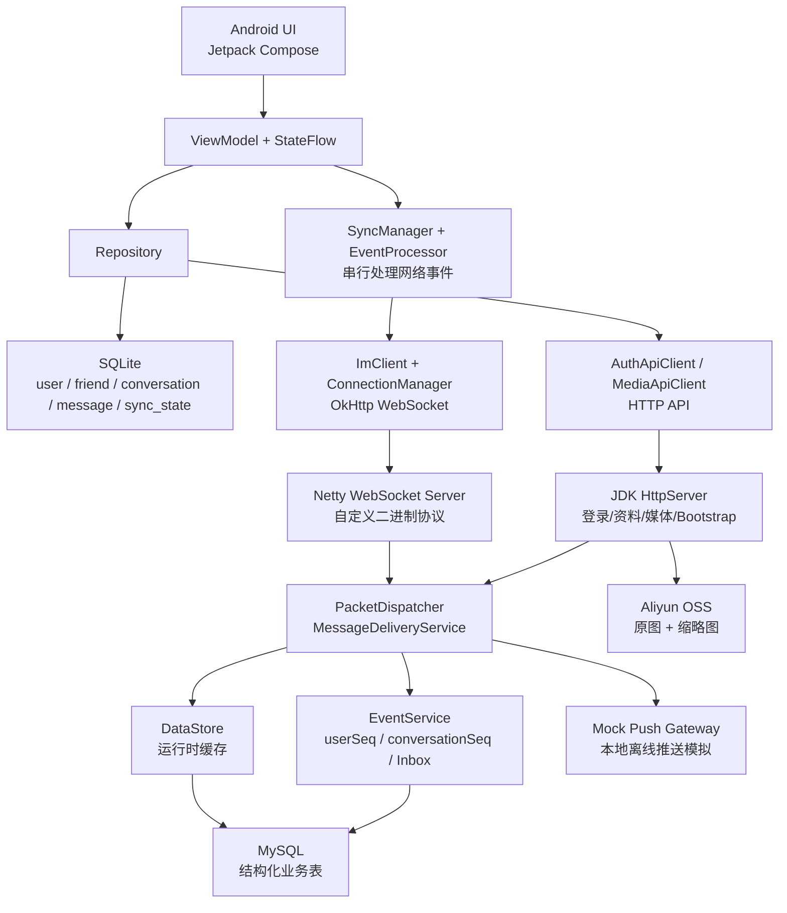
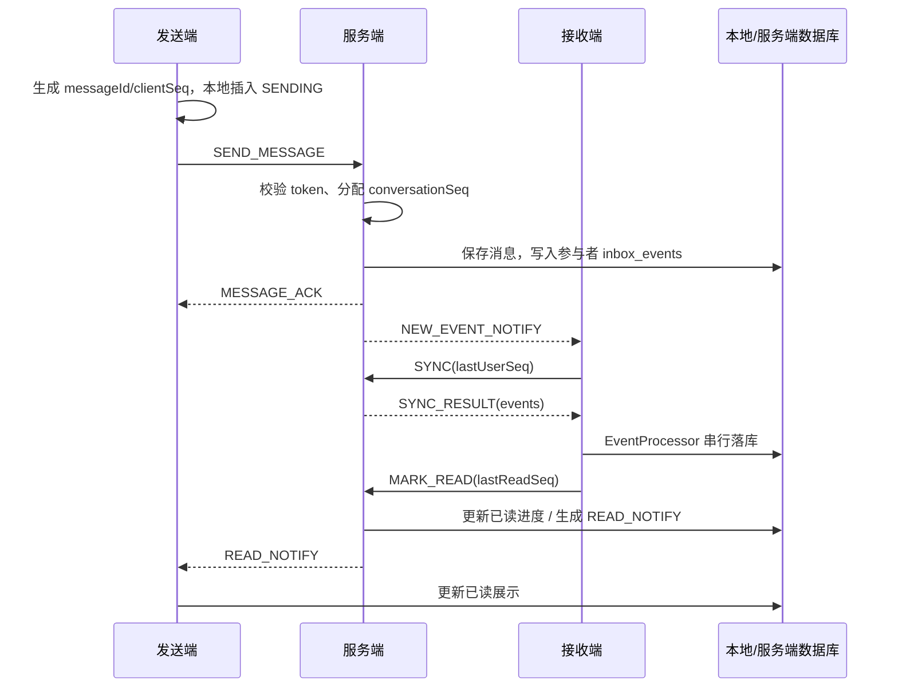

# LightChat 技术方案文档

本文档说明 LightChat 的整体架构、核心技术方案、关键难点解决方案和项目技术亮点。README 只保留快速入口，本文件作为项目答辩和技术评审的主说明文档。

## 一、整体架构

LightChat 采用 Android 客户端 + Kotlin/JVM 服务端的双端架构。客户端以 SQLite 作为页面数据源，服务端以 DataStore 作为运行时缓存，并通过 MySQL 结构化业务表持久化。长连接使用 WebSocket，自定义二进制协议承载 IM 命令；图片通过 HTTP 上传到阿里云 OSS，消息中只保存图片元信息。



### 分层说明

| 层级 | 职责 |
| --- | --- |
| UI 层 | Compose 页面、导航、消息气泡、图片预览、长按菜单和多选交互 |
| ViewModel 层 | 页面状态管理、发送消息、搜索、分页、图片选择状态 |
| Repository/DAO 层 | 封装 SQLite 查询、分页、资料缓存、会话更新 |
| Sync 层 | WebSocket 事件串行化处理、增量同步、游标推进 |
| 协议层 | 自定义二进制协议编码/解码、命令号管理、CRC 校验 |
| 服务端 Handler 层 | 鉴权、消息投递、ACK、已读、撤回、好友、群聊等命令处理 |
| 服务端存储层 | DataStore 运行时缓存 + MySQL 结构化表持久化 |
| 媒体层 | OSS 上传、签名 URL、缩略图、原图拉取和本地缓存 |

## 二、核心技术方案

### 2.1 自定义 WebSocket 二进制协议

WebSocket payload 使用自定义二进制包。协议头用于识别协议版本、命令、请求序号和 Body 长度；Body 为 UTF-8 JSON；尾部 CRC32 用于发现传输损坏。

```text
总长度 = 16 字节 Header + N 字节 Body + 4 字节 CRC32

0..1       magic        2 bytes   固定 0x4C43，即 LC
2          version      1 byte    当前版本 1
3          cmd          1 byte    命令号
4..11      seq          8 bytes   请求序号 Long
12..15     bodyLength   4 bytes   Body 字节长度 Int
16..15+N   body         N bytes   UTF-8 JSON
16+N..     crc32        4 bytes   CRC32(header + body)
```

协议命令包含 `AUTH`、`HEARTBEAT`、`SEND_MESSAGE`、`MESSAGE_ACK`、`SYNC`、`SYNC_RESULT`、`MARK_READ`、`READ_NOTIFY`、`RECALL_MESSAGE`、`CREATE_GROUP`、`ADD_GROUP_MEMBERS` 等。CRC32 只做完整性校验，不提供加密；生产环境需要 HTTPS/WSS。

### 2.2 消息收发链路



关键点：

- `clientSeq`：客户端本地发送顺序，解决发送中、失败、重发时的本地排序。
- `conversationSeq`：服务端分配的会话内顺序，用于最终排序、分页、搜索定位和已读进度。
- `userSeq`：服务端按用户维度分配的同步序号，用于 Inbox 增量同步和断网恢复。
- 客户端收到网络事件后先写 SQLite，再推进 `lastUserSeq`，避免“游标先走、数据没落库”的丢消息风险。

### 2.3 增量同步与断网恢复

服务端为每个用户维护 `inbox_events`。当用户离线或 WebSocket 断开时，消息、好友申请、已读、撤回、资料更新等事件都会进入该用户的 Inbox。

客户端保存 `sync_state.lastUserSeq`：

1. 登录或重连后发送 `SYNC(lastUserSeq)`。
2. 服务端查询 `inbox_events WHERE owner_user_id = ? AND user_seq > ? ORDER BY user_seq`。
3. 客户端按事件顺序串行落库。
4. 全部落库成功后更新本地 `lastUserSeq`。

这套设计让 WebSocket 只负责“实时通知”，最终可靠性由 Inbox + userSeq 保证。

### 2.4 已读回执方案

单聊和群聊均以 `conversationSeq` 作为已读进度。

- 接收端进入会话或停留在当前会话时，上报 `MARK_READ(conversationId, lastReadSeq)`。
- 服务端更新对应成员的 `last_read_seq`，并向消息发送者发送 `READ_NOTIFY`。
- 发端收到后更新本地消息状态。
- 群聊中普通消息显示 `x/y 已读`，@消息可以按被 @ 的成员显示具体已读/未读名单。

判断“对方是否已读我的最新消息”不是看时间，而是比较对方 `last_read_seq` 是否大于等于我方消息的 `conversationSeq`。

### 2.5 服务端存储方案

当前服务端采用 **DataStore 运行时缓存 + MySQL 结构化表持久化**：

1. 服务启动时，`MySqlStatePersistence.load()` 从结构化表读取用户、凭据、会话、消息、群组、好友申请和 Inbox 事件，并恢复到 `DataStore`。
2. 运行期间，业务处理器优先读写 `DataStore`，保持 IM 命令处理简单。
3. `DataStore` 变化后触发异步持久化任务，由 `MySqlStatePersistence.save()` 在事务内对 MySQL 表执行 upsert。
4. 已删除早期的 `lightchat_state` 整体快照表，服务重启恢复完全依赖结构化表。

核心表包括：

| 表 | 作用 |
| --- | --- |
| `users` / `credentials` / `auth_sessions` | 用户资料、密码凭据、JWT 会话 |
| `friendships` / `friend_requests` | 好友关系与好友申请 |
| `conversations` / `conversation_participants` / `conversation_members` | 会话基础信息、参与者和成员状态 |
| `messages` / `message_receipts` | 消息和回执 |
| `chat_groups` / `group_members` | 群资料和群成员 |
| `user_seq_counters` / `conversation_seq_counters` | 用户维度和会话维度序列号 |
| `inbox_events` | 用户增量同步事件队列 |

### 2.6 客户端本地持久化

客户端直接使用 `SQLiteOpenHelper`，未使用 Room。UI 主要读取 SQLite，本地表包括：

| 表 | 作用 |
| --- | --- |
| `user` | 用户资料和头像 URL/版本缓存 |
| `friend` / `friend_request` | 好友关系和好友申请 |
| `conversation` | 会话列表快照、最后消息、未读、置顶、免打扰 |
| `conversation_member` | 会话成员状态和已读进度 |
| `message` | 消息缓存，包含 `clientSeq`、`conversationSeq`、`userSeq` 和 `extra` |
| `sync_state` | 增量同步游标 `lastUserSeq` |
| `im_group` / `group_member` | 群资料和群成员 |
| `auth_session` | 本地登录会话 |

多账号通过 `owner_user_id` 隔离，避免同一设备切换账号时数据串号。

### 2.7 图片消息和对象存储

图片不通过 WebSocket 传原图，而是使用 HTTP 上传到阿里云 OSS：

1. 发送端选择图片，生成缩略图。
2. 服务端上传原图和缩略图到私有 OSS Bucket。
3. 消息 `extra` 保存 objectKey、原图 URL、缩略图 URL、宽高等元信息。
4. 接收端先显示缩略图，进入全屏或滑动到目标图片时再拉取原图。
5. 本地优先读取磁盘缓存；签名 URL 过期后向服务端刷新 URL。

这样可以避免大图片阻塞 WebSocket 消息通道，也让图片展示支持渐进式加载。

## 三、难点问题解决方案

### 3.1 并发网络事件导致消息乱序

**问题**：WebSocket 事件可能并发到达，例如新消息、已读、撤回、资料更新同时触发。如果多个协程同时写 SQLite，可能出现会话最后消息被旧事件覆盖、消息顺序错乱、同步游标提前推进。

**方案**：

- 网络事件统一进入同步处理链路。
- `EventProcessor` 串行处理事件，按 `userSeq` 顺序落库。
- 先写 SQLite，再更新 `sync_state.lastUserSeq`。
- 展示排序优先使用 `conversationSeq`，本地发送中消息使用 `clientSeq` 补位。

**效果**：即使网络事件并发到达，最终写库和展示仍保持稳定顺序。

### 3.2 发送失败消息破坏排序

**问题**：网络卡顿时消息未到服务端，拿不到 `conversationSeq`，如果只按服务端序号排序，失败消息会跑到列表底部或时间戳位置异常。

**方案**：

- 发送前立即生成 `messageId` 和 `clientSeq`，本地插入 `SENDING`。
- 500ms 未收到 ACK 显示发送中动画，2s 未收到 ACK 标记失败。
- 失败消息保留原始 `clientSeq` 和创建时间，继续参与本地排序。
- 重发时复用消息上下文，成功后用服务端返回的 `conversationSeq` 修正最终顺序。

**效果**：发送失败、重发和正常消息可以在同一列表中稳定展示。

### 3.3 已读状态不能及时同步

**问题**：双方都停留在聊天详情页时，接收端已经看到消息，但发送端已读状态不能立即变化，需要退出重进才刷新。

**方案**：

- 接收端在当前会话收到新消息后立即计算最新 `conversationSeq`。
- 主动发送 `MARK_READ`，而不是等页面重新进入。
- 服务端生成 `READ_NOTIFY` 推送给发送者。
- 发端收到后更新本地消息状态和会话展示。

**效果**：双方同时停留聊天页时，已读状态可以即时更新。

### 3.4 长聊天记录定位和分页卡顿

**问题**：1 万条消息场景下，如果一次性加载全部消息会卡顿；搜索进入中间消息后，向上/向下都需要继续加载，且不能自动滚走或丢失高亮。

**方案**：

- 聊天页按 `conversationSeq` 双向分页，每页约 80 条。
- 搜索定位时先围绕目标消息加载窗口数据，再把目标项滚动到屏幕中部。
- 加载更多前记录可见锚点，加载后恢复滚动位置。
- 高亮状态绑定目标 `messageId`，3 秒后清除，避免后续新消息误高亮。

**效果**：长会话可以从中间进入，支持上下继续加载，搜索结果定位更稳定。

### 3.5 图片加载、缓存和 URL 过期

**问题**：图片签名 URL 会过期；如果只保存旧 URL，切换账号或重新同步后可能无法加载原图。合并转发、名片、头像等页面也容易出现占位图。

**方案**：

- 图片消息 `extra` 保存 objectKey、缩略图 URL、原图 URL 和尺寸信息。
- 本地优先读取磁盘缓存，缓存不存在再使用 URL 下载。
- URL 过期时通过服务端刷新签名 URL。
- 刷新后的 URL 更新本地消息元信息，服务端也保留可重新签名的 objectKey。
- 头像使用 avatarUrl + avatarVersion 控制缓存刷新。

**效果**：图片和头像可以优先本地显示，URL 过期后仍能恢复加载。

### 3.6 相册和图片预览性能

**问题**：真机打开相册时，如果同步读取大量原图或大缩略图，会导致打开动画卡顿。

**方案**：

- 相册页只读取 MediaStore 必要字段。
- 缩略图后台加载，并使用 LruCache 复用。
- 图片压缩时 `inSampleSize` 按 2 的幂计算，避免部分设备 `decodeFile` 返回 null。
- 预览页和全屏页按当前可见图片渐进拉取原图。

**效果**：相册打开、预览滑动和聊天图片全屏切换更流畅。

## 四、技术亮点

### 4.1 自定义协议可抓包验证

项目没有直接使用纯文本 WebSocket，而是在 WebSocket 上实现了自定义二进制帧。协议头包含 magic、version、cmd、seq、bodyLength，尾部 CRC32。通过 Wireshark 可以直接观察 `0x4C43` magic、命令号和 WebSocket Binary Frame。

### 4.2 Inbox 增量同步保证可靠性

在线推送只负责提醒，真正的数据恢复依赖 `inbox_events + userSeq`。客户端无论是断网、切后台还是重连，都可以从本地 `lastUserSeq` 继续同步。

### 4.3 三套序列号拆分职责

`clientSeq`、`conversationSeq`、`userSeq` 分别处理本地发送顺序、会话最终顺序和用户同步进度，避免把排序、可靠性和同步游标混在一个字段里。

### 4.4 SQLite 作为页面数据源

客户端页面主要读取本地 SQLite，而不是直接依赖网络回调。网络事件只负责更新本地数据库，再由 ViewModel 刷新页面状态。这让离线查看、重连恢复和页面切换更稳定。

### 4.5 私有 OSS + 本地缓存

图片和头像走对象存储，消息只保存元信息。客户端优先读取本地缓存，URL 过期后刷新签名 URL，兼顾隐私、性能和可恢复性。

### 4.6 结构化 MySQL 持久化

服务端已删除早期整体状态快照，改为从 MySQL 结构化业务表恢复状态。这样数据库可以直接用于排查、压测数据注入和服务重启恢复。

### 4.7 性能验证友好

项目提供 `profile` 构建类型，支持 Android Studio Profiler 以 profileable 方式采集；同时对开屏、会话列表、聊天分页、图片解码和相册加载做了针对性优化。

## 五、测试与验证

| 类型 | 内容 |
| --- | --- |
| 单元测试 | 协议编解码、命令号、会话 ID、聊天时间、滚动控制、服务端投递、密码哈希、连接注册表、DataStore、EventService |
| CI | GitHub Actions 自动运行 Android 和 Server 单元测试，并构建 APK / 服务端包 |
| 抓包 | Wireshark 验证 WebSocket Binary Frame、自定义协议头和命令号 |
| 性能 | Profiler 验证 CPU/内存曲线；真机验证开屏、相册、长聊天记录和会话列表 |
| 人工回归 | 单聊、群聊、@提醒、图片、转发、撤回、已读、搜索、离线通知 |

本地测试命令：

```powershell
.\gradlew.bat :app:testDebugUnitTest :server:test
```
